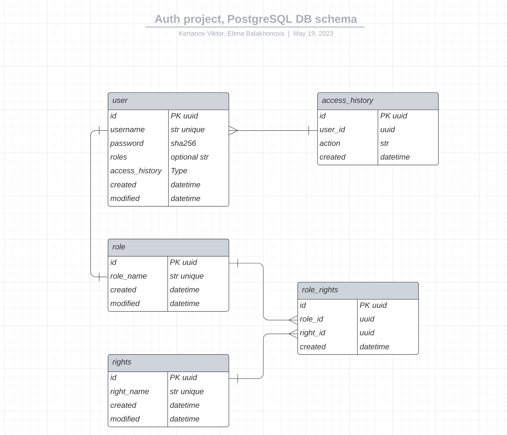

# Auth Project дорожная карта

### ***Команда №2:** Елена Балахонова, Кертанов Виктор*

***

## Cтэк используемых технологий

**Flask**: Flask будет управлять эндпоинтами и логиком, взаимодействием с базой данных и клиентом.

**SQLAlchemy**: ORM для инициализации базы данных для взаимодействия с PostgreSQL.

**PostgreSQL**: Хранение данных о пользователях, ролях, правах доступа.

**Redis**: Управление рэфрэш токенами, которые имеют срок годности. Если пользователь разлогинится, мы удаляем соответствующю запись из Redis.

**JWT**: Вместо сессий и кукиз, будем использовать JWT. Авторизация, успешный логин, генерация access token JWT и refresh token JWT. Access token имеет короткий лайфспэн - 15 минут, refresh token -- например, 7 дней. Access token используется для авторизации, refresh token используется для генерации новых access token'ов.

**Docker**: Все сервисы поднимаются через docker-compose: Flask, PostgreSQL, Redis, Nginx для обратного проксирования запросов к Flask.

**Nginx**: Обратное проксирование запросов и балансировка.

**Gunicorn/Gevent**: Работа с большим количеством запросов и соединений одновременно.

</br>

## PosgreSQL DB: предлагаемая схема

[Ссылка на схему PostgreSQL DB](https://lucid.app/lucidchart/855c04f2-3b29-4e48-920f-e2b527d88393/view?page=0_0&invitationId=inv_b5da600a-e298-4d10-8a3d-8d53c63755ec#)



**NB:**  добавить в user model email.

## Redis

Сервис Redis будет использоваться для хранения access JWT token'ов и refresh JWT token'ов.
Пара refresh token / access token выдается после успешной авторазиации в Auth сервисе -- то есть если пользователь вводит правильные логин и пароль.
Структура ключа: `<access/refresh>:<user_id>:<user_agent>`.
Соответствующее ключу значение: `<JWT token>`, payload содержит инфо о user_id и правах, а также `iat` (issued-at) поле или `exat` (expires-at) поле.

</br>

При компрометировании токена для определенного пользователя можно удалить все ключи, где есть его user_id.

</br>

Для анонимных пользователей можно вместо `user_id` в ключе и в JWT token писать `anonymous/guest` и прописать, какие эндпоинты API доступны для `user` == `guest`.

Токены JWT будут передаваться в `header` всех запросов, отправляемых на все ресурсы: `{Authorization: Bearer <JWT TOKEN>}`.

</br>

## Api Endpoints

Структура API будет выглядеть примерно вот так: [Api Schema, OpenApi 3.0.1 формат](raw_api_schema.yaml)

[Open API Editor](https://editor-next.swagger.io/)

## Роли пользователей (Roles)

- **superuser**: суперпользователь, который имеет все права
- **admin**: имеет все права кроме присваивания роли суперпользователя
- **user**: имеет доступ к личному аккаунту и информации, имеет возможность изменить пароль, доступ к премиальному контенту (опционально)
- **guest**: всё, что не запрещено -- разрешено.

Когда человек регистрируется в системе, то ему автоматически присваивается роль `user`? Или же нужно, чтобы `admin`, `superuser` могли сразу иметь возможность зарегистрировать человека админом (других вариантов в текущей реализации не предполагается).


## Права

- Повысить юзера до админа (суперюзер/админ)
- Залогаутить юзера (суперюзер/админ)
- Посмотреть профиль юзера (суперюзер/админ/юзер)
- Изменить пароль (юзер)
- 
  


***
***

## Проектная работа 6 спринта

С этого модуля вы больше не будете получать чётко расписанное ТЗ, а задания для каждого спринта вы найдёте внутри уроков. Перед тем как начать программировать, вам предстоит продумать архитектуру решения, декомпозировать задачи и распределить их между командой.

В первом спринте модуля вы напишете основу вашего сервиса и реализуете все базовые требования к нему. Старайтесь избегать ситуаций, в которых один из ваших коллег сидит без дела. Для этого вам придётся составлять задачи, которые можно выполнить параллельно и выбрать единый стиль написания кода.

К концу спринта у вас должен получиться сервис авторизации с системой ролей, написанный на Flask с использованием gevent. Первый шаг к этому — проработать и описать архитектуру вашего сервиса. Это значит, что перед тем, как приступить к разработке, нужно составить план действий: из чего будет состоять сервис, каким будет его API, какие хранилища он будет использовать и какой будет его схема данных. Описание нужно сдать на проверку. Вам предстоит выбрать, какой метод организации доступов использовать для онлайн-кинотеатра, и систему прав, которая позволит ограничить доступ к ресурсам.

Для описания API рекомендуем использовать [OpenAPI](https://editor.swagger.io){target="_blank"}, если вы выберете путь REST. Или используйте текстовое описание, если вы планируете использовать gRPC. С этими инструментами вы познакомились в предыдущих модулях. Обязательно продумайте и опишите обработку ошибок. Например, как отреагирует ваш API, если обратиться к нему с истёкшим токеном? Будет ли отличаться ответ API, если передать ему токен с неверной подписью? А если имя пользователя уже занято? Документация вашего API должна включать не только ответы сервера при успешном завершении запроса, но и понятное описание возможных ответов с ошибкой.

После прохождения ревью вы можете приступать к программированию.

Для успешного завершения первой части модуля в вашем сервисе должны быть реализованы API для аутентификации и система управления ролями. Роли понадобятся, чтобы ограничить доступ к некоторым категориям фильмов. Например, «Фильмы, выпущенные менее 3 лет назад» могут просматривать только пользователи из группы 'subscribers'.  

## API для сайта и личного кабинета

- регистрация пользователя;
- вход пользователя в аккаунт (обмен логина и пароля на пару токенов: JWT-access токен и refresh токен);
- обновление access-токена;
- выход пользователя из аккаунта;
- изменение логина или пароля (с отправкой email вы познакомитесь в следующих модулях, поэтому пока ваш сервис должен позволять изменять личные данные без дополнительных подтверждений);
- получение пользователем своей истории входов в аккаунт;

## API для управления доступами

- CRUD для управления ролями:
  - создание роли,
  - удаление роли,
  - изменение роли,
  - просмотр всех ролей.
- назначить пользователю роль;
- отобрать у пользователя роль;
- метод для проверки наличия прав у пользователя.

## Подсказки

1. Продумайте, что делать с анонимными пользователями, которым доступно всё, что не запрещено отдельными правами.
2. Метод проверки авторизации будет всегда нужен пользователям. Ходить каждый раз в БД — не очень хорошая идея. Подумайте, как улучшить производительность системы.
3. Добавьте консольную команду для создания суперпользователя, которому всегда разрешено делать все действия в системе.
4. Чтобы упростить себе жизнь с настройкой суперпользователя, продумайте, как сделать так, чтобы при авторизации ему всегда отдавался успех при всех запросах.
5. Для реализации ограничения по фильмам подумайте о присвоении им какой-либо метки. Это потребует небольшой доработки ETL-процесса.

## Дополнительное задание

Реализуйте кнопку «Выйти из остальных аккаунтов», не прибегая к хранению в БД активных access-токенов.

## Напоминаем о требованиях к качеству

Перед тем как сдать ваш код на проверку, убедитесь, что

- Код написан по правилам pep8: при запуске [линтера](https://semakin.dev/2020/05/python_linters/){target="_blank"} в консоли не появляется предупреждений и возмущений;
- Все ключевые методы покрыты тестами: каждый ответ каждой ручки API и важная бизнес-логика тщательно проверены;
- У тестов есть понятное описание, что именно проверяется внутри. Используйте [pep257](https://www.python.org/dev/peps/pep-0257/){target="_blank"};
- Заполните README.md так, чтобы по нему можно было легко познакомиться с вашим проектом. Добавьте короткое, но ёмкое описание проекта. По пунктам опишите как запустить приложения с нуля, перечислив полезные команды. Упомяните людей, которые занимаются проектом и их роли. Ведите changelog: описывайте, что именно из задания модуля уже реализовано в вашем сервисе и пополняйте список по мере развития.
- Вы воспользовались лучшими практиками описания конфигурации приложений из урока.

## AUTH Code Review Issues
Здравствуйте ! Отлично поработали ! Есть небольшие рекомендации:

✅ 1. [Здесь](https://github.com/dramaqu33n/Auth_team_2/blob/45eb7a7c716d54c5494b1b7098a09a1d2ae76b60/utils/backoff.py#L33) было бы более универсальное решение - принимать например кортеж исключений на которые нужно реагировать. Посмотрите для примера например реализацию https://github.com/invl/retry

✅ 2. [Здесь](https://github.com/dramaqu33n/Auth_team_2/blob/45eb7a7c716d54c5494b1b7098a09a1d2ae76b60/Dockerfile#L12) не нужно копировать .env внутрь образа, пользуйтесь возможностью передачи значений с помощью переменных окружения - https://docs.docker.com/compose/environment-variables/set-environment-variables/

✅ 3. [Тут](https://github.com/dramaqu33n/Auth_team_2/blob/45eb7a7c716d54c5494b1b7098a09a1d2ae76b60/Dockerfile#L22) можно добавить `RUN chmod +x /startup.sh`, например чтоб 100% у файла были права на выполнение.

4. Для целей разработки и тестирования давайте сделаем возможность выключать трассировщик и лимитер с помощью настроек через переменные окружения.

5. [Здесь](https://github.com/dramaqu33n/Auth_team_2/blob/45eb7a7c716d54c5494b1b7098a09a1d2ae76b60/src/app.py#L102) неплохо было бы добавить перехватчик необработанных исключений, чтоб на клиента всегда возвращался JSON ответ - https://flask.palletsprojects.com/en/2.3.x/errorhandling/#generic-exception-handlers

✅ 6. [Здесь](https://github.com/dramaqu33n/Auth_team_2/blob/main/src/models/__init__.py) пустой пакет, может удалить каталог models если не используется ?

7. [Здесь](https://github.com/dramaqu33n/Auth_team_2/blob/45eb7a7c716d54c5494b1b7098a09a1d2ae76b60/src/db/db_config.py#L1) вы использовали чистоую алхимию, но я бы вам посоветовал использовать библиотеки которые у вас уже есть в зависимостях - https://github.com/dramaqu33n/Auth_team_2/blob/45eb7a7c716d54c5494b1b7098a09a1d2ae76b60/requirements.txt#L24 и https://github.com/dramaqu33n/Auth_team_2/blob/45eb7a7c716d54c5494b1b7098a09a1d2ae76b60/requirements.txt#L21 для интеграции во Flask миграций и ОРМ. Так будет меньше кода, так будут закрываться сессии к БД в нужный момент. Например не нужно было бы писать вот подобный код - https://github.com/dramaqu33n/Auth_team_2/blob/main/src/db/init_migrate.py. 

8. [Здесь](https://github.com/dramaqu33n/Auth_team_2/blob/45eb7a7c716d54c5494b1b7098a09a1d2ae76b60/src/db/superuser.py#L21) можно посмотреть на возможность написать именно команду https://flask-docs.readthedocs.io/en/latest/cli/#custom-commands. Можно сделать параметризованную команду вроде джанговой createsuperuser.

9. Напишите инструкцию с шагами запуска Вашего приложения, как накатить миграции, как создать суперпользователя и возможно дефолтные группы.

10. [Тут](https://github.com/dramaqu33n/Auth_team_2/blob/45eb7a7c716d54c5494b1b7098a09a1d2ae76b60/src/api/v1/auth.py#L22-L46) вы прямо в обработчике запроса делаете запросы в БД, храните по сути всю логику. Неплохой практикой является вынести бизнес логику в слой сервисов и из обработчика вызывать соотвествующие методы сервиса. Второй момент - отсутствует валидация параметров - есть вот такая библиотека https://flask-marshmallow.readthedocs.io/en/latest/index.html попробуйте разобраться и прикрутить валидацию принимаемых параметров.

11. [Здесь](https://github.com/dramaqu33n/Auth_team_2/blob/45eb7a7c716d54c5494b1b7098a09a1d2ae76b60/src/api/v1/history.py#L25) получится лаконичнее если используете https://flask-sqlalchemy.palletsprojects.com/en/3.0.x/pagination/#paging-query-results

12. [Тут](https://github.com/dramaqu33n/Auth_team_2/blob/45eb7a7c716d54c5494b1b7098a09a1d2ae76b60/src/api/v1/oauth.py#L32-L33) второй вызов перетирает предыдущее значение.

✅ 13. [Тут](https://github.com/dramaqu33n/Auth_team_2/blob/main/tests/functional/requirements.txt) пустой файлик.

## Code Review Issues

Добрый день.

Хорошая работа! Но еще есть над чем поработать.

1. ✅ [исправить] Лучше не выставлять [порты](https://github.com/dramaqu33n/Auth_team_2/blob/785f8259115bbbedec14c0ae026503fa431f1443/docker-compose.yml#L13) наружу у сервисов, так как это плохая практика с точки зрения безопасности. Наружу должен быть выставлен только 80 от nginx. Если все таки вот этом есть необходимость (в выставлении портов), то лучше создать отдельный файл docker-compose.dev.yml. 

**Вопрос:** что со сваггером -- норм ли оставлять порты к нему опубликованными? 

2. ✅ [исправить] Лучше указывать конкретную [версию](https://github.com/dramaqu33n/Auth_team_2/blob/785f8259115bbbedec14c0ae026503fa431f1443/docker-compose.yml#L61) образа. Зачем? Со временем проект может обрасти большим количеством зависимостей, которые могут быть несовместимы с самой последней версией образа и из-за этого могут быть проблемы со сборкой приложения. Тоже самое касается образов redis и postgres.
https://www.docker.com/blog/speed-up-your-development-flow-with-these-dockerfile-best-practices/#no-more-latest

3. ✅ [можно лучше] Приложение лучше [запускать](https://github.com/dramaqu33n/Auth_team_2/blob/785f8259115bbbedec14c0ae026503fa431f1443/docker-compose.yml#L38) прямо в Dockerfile. Так как контейнер должен быть "самодостаточным" и не зависеть от других систем по развертыванию приложений. Сегодня используется docker-compose, завтра k8s итд. Чтобы контейнер можно было запускать везде, лучше вынести команду запуска прямо в Dockerfile.
4. ✅ [можно лучше] По умолчанию pydantic [не чувствителен](https://docs.pydantic.dev/latest/usage/settings/#environment-variable-names) ("Case-sensitivity can be turned on through the Config") к регистру при работе с [переменными](https://github.com/dramaqu33n/Auth_team_2/blob/785f8259115bbbedec14c0ae026503fa431f1443/src/core/config.py#LL11C1-L11C30) окружения. Поэтому, если название переменной окружения в классе-конфиге совпадает с названием в .env-файле, то можно дополнительно не указывать `env='REDIS_PORT'`, т.е., достаточно записать вот так:
      ```
      class Settings(BaseSettings):
          ...
          redis_host: str
          redis_port: int = 6379
          ...
      ```
5. ✅ [можно лучше] Pydantic под капотом использует [загрузку переменных](https://docs.pydantic.dev/latest/usage/settings/#dotenv-env-support) окружения через библиотеку dotenv. Поэтому [эта](https://github.com/dramaqu33n/Auth_team_2/blob/785f8259115bbbedec14c0ae026503fa431f1443/src/core/config.py#L8) строка избыточна. Можете попробовать ее убрать и у вас все должно работать.
6. ✅ [можно лучше] Название типа [токена](https://github.com/dramaqu33n/Auth_team_2/blob/785f8259115bbbedec14c0ae026503fa431f1443/src/db/redis.py#L21) лучше поместить в enum. Использование enum избавляет от опечаток в строковых литералах. Можно случайно прописать кириллический символ в строке и потом очень долго гадать из-за чего возникла ошибка.
7. [можно лучше] У flask есть встроенная возможность по созданию [кастомных команд](https://flask.palletsprojects.com/en/2.3.x/cli/#custom-commands). Рекомендую к ним присмотреться, чтобы не писать [свои](https://github.com/dramaqu33n/Auth_team_2/blob/785f8259115bbbedec14c0ae026503fa431f1443/Makefile#L13) "велосипеды" :)
8. ✅ [исправить] Не увидел у вас прикрученной доки (swagger) в сервисе. Для решения данной проблемы могу посоветовать [эту](https://github.com/flasgger/flasgger) библиотеку.
9. [можно лучше] Было бы неплохо собрать все описания [ошибок](https://github.com/dramaqu33n/Auth_team_2/blob/785f8259115bbbedec14c0ae026503fa431f1443/src/api/v1/auth.py#L29) в одном месте, чтобы в случае чего их можно было оперативно поменять. Может измениться локализация или банально захочется внести правки в текст. Сейчас придется ходить по всему коду, чтобы внести правки, что понятно может отнять прилично времени.
10. ✅ [исправить] Не хватает "ручки" для просмотра истории входов.
11. ✅ [исправить] Еще не хватает "ручки" для обновления токена.
12. ✅ [исправить] Лучше удалять [закомментированный](https://github.com/dramaqu33n/Auth_team_2/blob/785f8259115bbbedec14c0ae026503fa431f1443/src/api/v1/rights.py#L1) код, если он больше нигде не планируется использоваться. Так код будет проще читать другому программисту и он не будет тратить дополнительное время на чтение закомментированных строк. Если код действительно важен и его панируется использовать в будущем, то можно сделать коммит и в случае чего откатится на него. Или можно сделать отдельную ветку для таких целей, чтобы в случае чего вмерджить эту функциональность в dev/master ветку.
